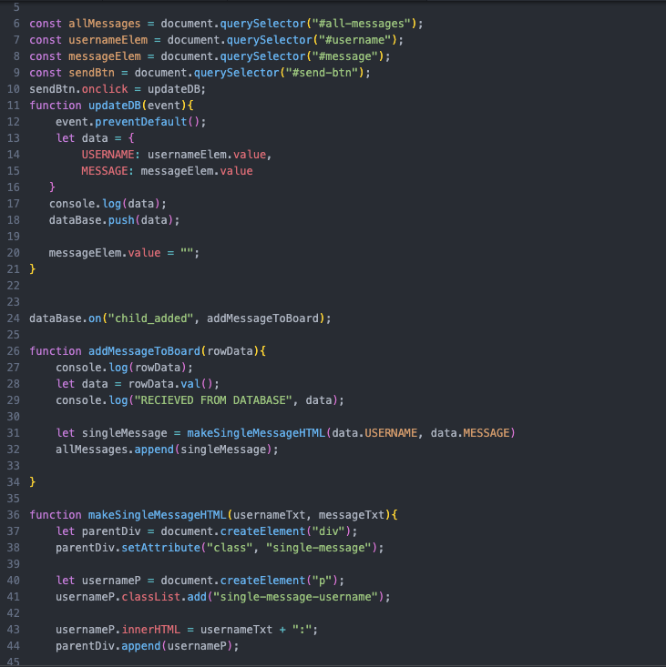

# Entry 2
##### 12/17/22

### Context
I'm in the **EDP of define, research and brainstorm the solution** because this is the hardest tool I have use, so I need to know what problem I have from it such as before starting anything, I need to connected my firebase to **ide.cs50.io**. After knowing my problem I would need to look/research solution in order to solve this problem. I can do this by looking on youtube or looking at the official website of Firebase. I could even look at my coding lesson solution from previous bootcamp in the summer I had. Finaly after I know my problem and find possible solution I would need to test it out.

### Tool
In the previous Blog entry, I had to tried to find which Tool I really want to do in this year lesson and I made my decision of doing FireBase. Firebase have many function from realtime database, Cloud fireStore, Authentication, and Storage.  I choose Storage. It allow me to store photo and files. My goal for this tool is able to store music into the Storage.

### Starting/Tinkering
In order to learn FireBase and how to connected it. I have tried to use my past knowledge in my program where I learn how connect firebase. The first thing I did was to login into firebase with a personal account --> create a project --> add the realtime database --> config the database --> copy and past the config --> paste into the script.js in my cs50. Then I used Dom to connect bottom and the type input. I use realtime data base was to test out if I can connect it first due I have done this before. After completing everything I went to test it out, but the problem was it that not connected. it state that the "initial firebase was not define".

My first tinkering didn't work, so then I just went to my solution where my teacher have posted the solution for a project for realtime database. I bascially copy everything and test it out again, but it have the same error where the "initial Firebase was not define". The only thing I change my getting a new api for the config and initial, If I literally copy everything, the code wouldn't work because of the key wasn't mine or it was expire.

My second solution didn't work either, so then my final solution is just looking up at youtube or the official website on firebase and restart from scratch. I didn't really know the reason why it states that the initial firebase it not define, maybe firebase got an update and change something. Using the video it was very confusing and tried my best to understand the video because their were many new... [Youtube](https://www.javatpoint.com/firebase-introduction#:~:text=Firebase%20(a%20NoSQLjSON%20database)%20is,%2C%20IOS%2C%20and%20Web%20apps.) and [Official video](https://firebase.google.com/docs/web/setup)

### Takeaway
This blog have help me develop how to google, how to learn, embracing failure and growth mindset. first in order tinkler with firebase I need to have the mental capacity of wanting to learn and able to deal with my failure because I tried three ways to tried to learn my tools about firebase, even though I wasn't able to figure the reason why it doesn't work. It allowed me to learn something else about it. Such as needing the DOM and doing this blog entries.

[Previous](entry01.md) | [Next](entry03.md)

[Home](../README.md)
